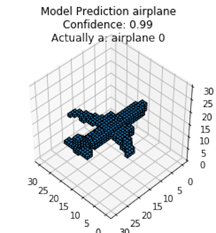
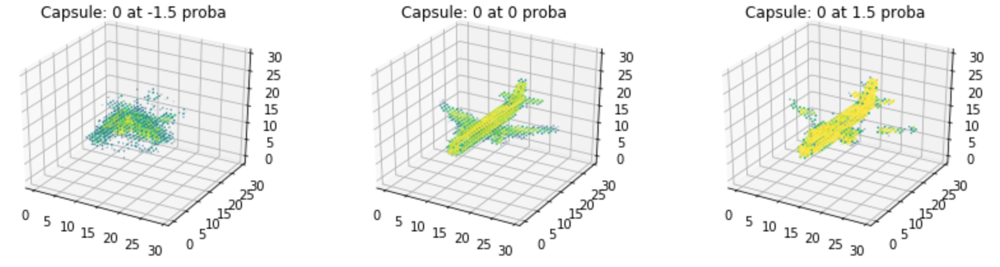

# Capsule Nets for Content Based 3D Model Retrieval
Reference: https://github.com/Ryanglambert/3d_model_retriever/tree/master

|   |    |
|:----------------:|:-----------------:|
|  |  |

## Paper
[Content-Based 3D Model Retrieval](Content%20Based%203d%20Model%20Retrieval.pdf)

## Results
T.B.D

## TODO:
T.B.D

## Setup

**Download the data**

```
cd 3d_model_retriever/
wget http://vision.princeton.edu/projects/2014/3DShapeNets/ModelNet10.zip
unzip ModelNet10.zip
```
Recommended to download directly, because wget is not supported for some platform

**Install binvox binary**

In the root of the project

- MACOSX install:

```
    wget http://www.patrickmin.com/binvox/mac/binvox\?rnd\=1520896803665325 -O binvox
    chmod 755 binvox
```
- Linux install:

```
    wget http://www.patrickmin.com/binvox/linux64/binvox?rnd=1520896952313989 -O binvox
    chmod 755 binvox
```
- Window install:
```
    Go directly into the website and download: https://www.patrickmin.com/binvox/
	Shortage link: https://www.patrickmin.com/binvox/download.php?id=2
```
**Make env**

```
cd 3d_model_retriever
python3 -m venv .env
source .env/bin/activate
pip install -r mac_requirements.txt
```
    
**Convert all &ast;.off files to &ast;.binvox**

```
python binvox_converter.py ModelNet10/ --remove-all-dupes
```     
Confirmed the process just done by local environment, when install binvox.exe and add path to system variable.

Can not run in ggcolab, although installed binvox and upload file in directory.

So if you would like to run in ggcolab, remember to run binvox in local first, then training in ggcolab later.

**After converted, confirm it by using cmd**

Locate at "path\ModelNet10\ModelNet10"
```
dir /s /b *.binvox | find /c ".binvox"
```  
It should print the value of 4899

**Aggregate**

Our last step is to aggregate the 4,899 data files into a single NumPy archive, for ease of access. 
We’ll also pad the data using np.pad so that each example is 30 x 30 x 30.

We’ll use binvox_rw to read the .binvox files as NumPy arrays.

**Prepare data for training**

Use a script to process the .binvox files into a compressed .npz file for easier handling in machine learning workflows.

Make sure binvox_re.py is the same directory with preprocess.py (inside Scripts/)
```
python scripts/preprocess.py
``` 
After running this script, it Stores the training and testing data in a compressed file: data/modelnet10.npz.

**Additional Notes (refer from the root page)**

*.off files

Processing *.off files is done by a 3rd party tool made by Patrick Min.

- https://www.patrickmin.com/binvox/

What the hell is an *.off file?

- http://segeval.cs.princeton.edu/public/off_format.html

Voxel Resolution

- http://vision.princeton.edu/projects/2014/3DShapeNets/paper.pdf

"To study 3D shape representation, we propose to represent
a geometric 3D shape as a probability distribution of
binary variables on a 3D voxel grid. Each 3D mesh is represented
as a binary tensor: 1 indicates the voxel is inside the
mesh surface, and 0 indicates the voxel is outside the mesh
(i.e., it is empty space). The grid size in our experiments is
30 × 30 × 30."

```
./binvox -cb -e -c -d 30 sample.off
```

- -e  is important, with a lot of troubleshooting it was shown that not using this led to inconsistent voxelization :headache:
        
** *Viewing .binvox data for troubleshooting* **

```
./viewvox <filename>.binvox
```
        
## Load The Data in Python

```
from data import load_data
(x_train, y_train), (x_test, y_test), target_names = load_data('./ModelNet10')
```
